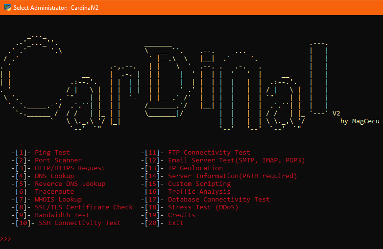

# CardinalV2
Cardinal is a toolkit made for doing various tests on various types of servers. The idea behind it is having everything you need for perfoming tests in one versatile program. It is still in development so there can be changes overtime. 

<p align="center">
  
</p>
## Usage
ONLY COMPATIBLE WITH WINDOWS!(for now)

YOU WILL HAVE TO INSTALL WIRESHARK FOR THE SCRIPT TO WORK PROPERLY! Note that if you are installing the libs via command.
```
pip install -r requirements.txt
```
I have added a setup.bat file if you are lazy and want it done with one click :)

# Options
* Ping Test: Check the connectivity to a server by sending ICMP echo requests and waiting for replies.
* Port Scanner: Scan for open ports on the server to identify potential vulnerabilities or services running.
* HTTP/HTTPS Request: Send HTTP/HTTPS requests to test web server responsiveness and gather information about web services.
* DNS Lookup: Resolve domain names to IP addresses to verify DNS configuration.
* Reverce DNS Lookup: resolving an IP address to its associated domain name
* Traceroute: Determine the network path to the server and identify any hops experiencing latency or packet loss.
* WHOIS Lookup: Retrieve registration information for a domain name or IP address to determine ownership and contact details.
* SSL/TLS Certificate Check: Verify the validity and configuration of SSL/TLS certificates used by the server.
* Bandwidth Test: Measure the upload and download speeds between the client and server to assess network performance.
* SSH Connectivity Test: Verify SSH connectivity and attempt to log in to the server using SSH credentials.
* FTP Connectivity Test: Check FTP server connectivity and attempt to establish a connection to transfer files.
* Email Server Test: Test SMTP, IMAP, or POP3 connectivity to verify email server functionality.
* IP Geolocation: Determine the geographical location of the server based on its IP address.
* Server Information: Retrieve basic information about the server such as operating system, server software, and uptime.
* Custom Scripting: Allow users to execute custom scripts or commands on the server for advanced testing and automation.
* Traffic Analysis: Monitor network traffic to and from the server to identify any unusual patterns or potential security threats.
* Database Connectivity Test: Check connectivity to database servers such as MySQL, PostgreSQL, or MongoDB and perform basic queries.
* Stress Test: evaluating a server's performance, reliability, and stability under extreme conditions

# Constributors
MagCecu
* discord: magcecu
* telergam: https://t.me/OneandOnlyMag
# External links
* https://discord.gg/P8sKTTndqk
